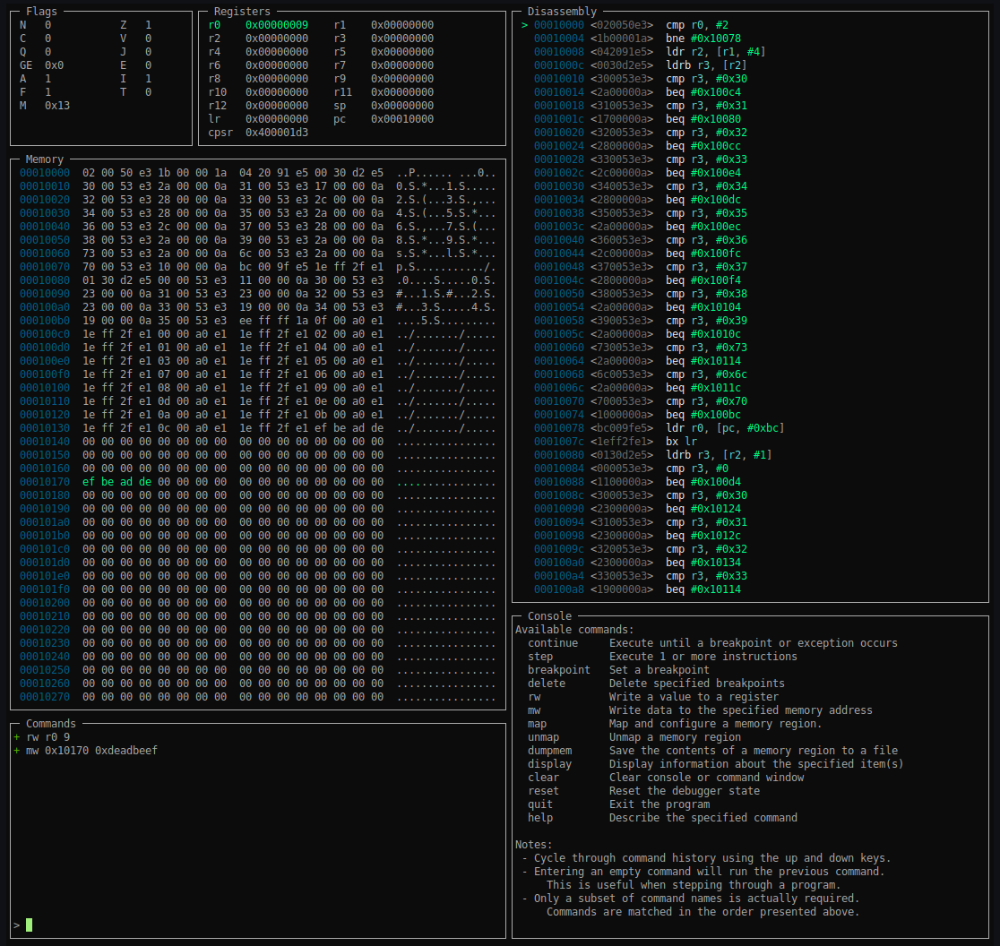

# aemulari

**aemulari** is a little Go-based console UI front-end for [Unicorn],
using [Capstone], [capstr], and [gocui]. I wrote it to help me think through
32-bit ARM bare-metal code that I was otherwise reverse engineering statically.

Why this tool? For whatever reason, QEMU and GEF just wasn't doing it for me,
so I built the tool I wanted.

At the moment, you should consider this an open source project that's 
pretty much entirely inactive, as I haven't really touched it much since 2018,
where I presented it at [BSidesROC]. 

I originally intended to keep working on it to release something more
featureful, but alas, how time flies. I never got around to it.

If you're interested in taking this further, please reach out before forking.
I may be interested in picking this back up to actively maintain, as I use it
from time to time. Personally, I'd say efforts are better spent investing 
in something based upon [usercorn]. :)

[usercorn]: https://github.com/lunixbochs/usercorn

# Dependencies

* [Unicorn] - CPU Emulator Framework
    * libunicorn.so.1
    * [libunicorn Go bindings]
* [Capstone] - Disassembly Framework
    * libcapstone.so.1
    * Go bindings: [capstr]
* [gocui] - Console UI library

The provided *Makefile* will fetch and build Go dependencies. 

However, you will first need to build and install *libunicorn* and
*libcapstone* on your own.

For both of those, the build process is pretty simple:

~~~
git clone <repo>
mkdir <repo>/build && cd <repo>/build
cmake -DCMAKE_INSTALL_PATH=/usr/local
make
sudo make install
~~~

[Unicorn]: https://github.com/unicorn-engine/unicorn
[libunicorn Go bindings]: https://github.com/unicorn-engine/unicorn/tree/master/bindings/go

[Capstone]: https://github.com/aquynh/capstone
[capstr]: https://github.com/lunixbochs/capstr

[gocui]: https://github.com/jroimartin/gocui

[BSidesROC]: https://www.youtube.com/watch?v=CzHaK7cqak4

# Build

To the great displeasure of Gophers everywhere, there's a Make-based build.
(I learned Go in 2017 to write this... I was already behind the times WRT
 gomods and a proper build setup.)

Run `make` and `aemulari-cui` and `aemulari` will be build and written to a 
`bin/` directory.  The former is the UI, while the latter was intended for batch
execution.

# Usage

Below is the help text for the `aemulari-cui` tool, which can be viewed via `--help`.

~~~
aemulari-cui -- Console UI frontend for the aemulari debugger (v0.1.0)
Usage: aemulari-cui [options]

Options:
  -a, --arch <arch>           Architecture to emulate. (default: arm)
  -r, --reg <name>=<value>    Assigns the initial value of a register.
  -m, --mem <region>          Memory region to map and optionally load or dump.
  -b, --break <addr>          Set a breakpoint at the specified address.
  -h, --help                  Show this text and exit.

Supported Architectures and Initial Modes:
  arm          32-bit Arm
  arm:thumb    32-bit Arm in Thumb mode

Memory Mapped Regions:
  Memory mapped regions are specified using the following syntax:

    <name>:<addr>:<size>:[perms]:[input file]:[output file]

  - An executable region named "code" is required.
  - Only the <name>, <address>, and <size> fields are required. When including
      an optional field, all preceding optional fields must be specified well.
  - The [perms] field specifies the access permissions of a region using the
      characters 'r', 'w', and 'x' for read, write, and execute, respectively.
	   If not specified, a default of "rwx" is used.
  - If specified, the contents of [input file] will be loaded into the region.
  - If specified, a memory region's contents will be written to [output file].

Notes:
 - Numeric parameters may be specified in decimal format or in hex format,
     prefixed with "0x" (e.g., 0x1b4d1d3a).
 - Available GUI commands can be viewed by running the "help" command.

Examples:
  Run myprogram.bin with memory at 0x48000 initialized with the contents
  of a mydata.bin file.
    aemulari -m code:0x10000:0x1000:rx:./myprogram.bin \
      -m mydata:0x48000:0x200:rwx:./mydata.bin

  Execute myprogram.bin with the breakpoints set. Note that 
  breakpoints can also be set from within the GUI.
    aemulari -m code:0x48000000:0x4000:rx:./myprogram.bin \
      -m mydata:0x80000000:0x4000:rw::./mydata.bin
~~~

# Known Issues

A couple of known issues are presented [here](KNOWN_ISSUES.md). 
